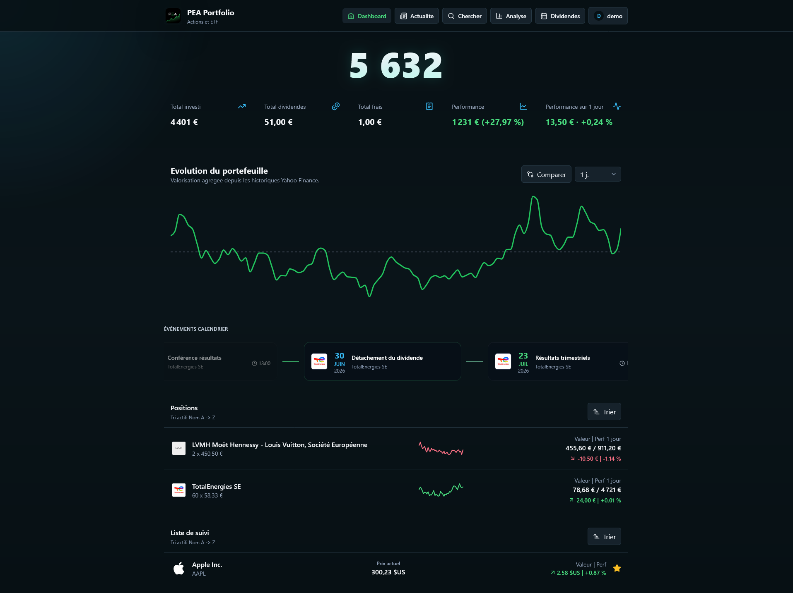
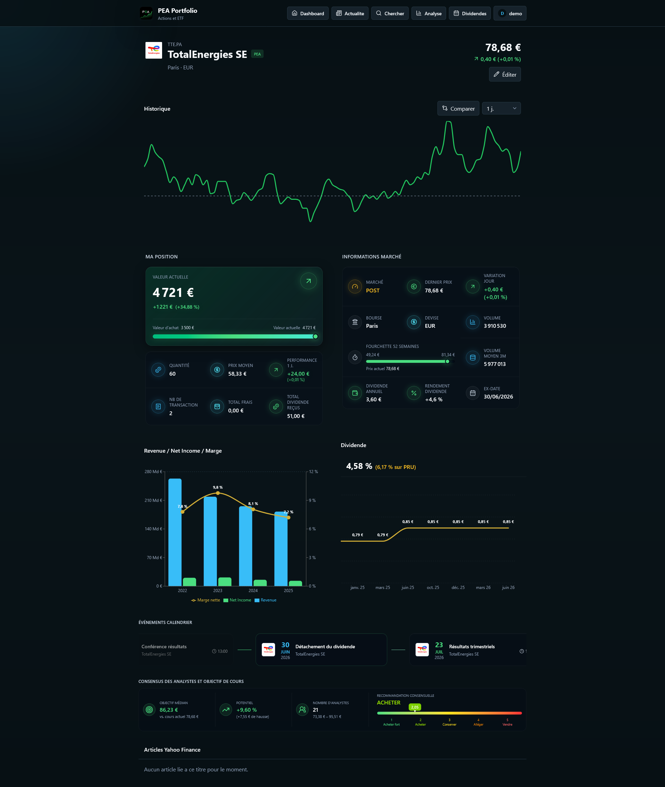
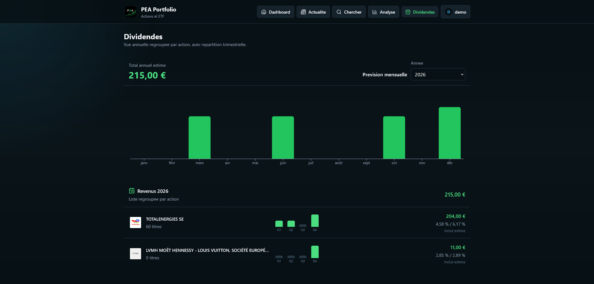
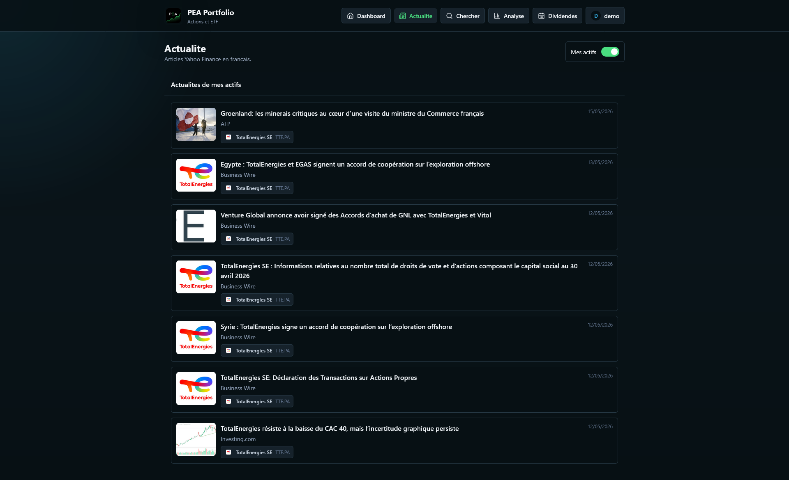

<p align="center">
  
</p>

<h1 align="center">PEA Portfolio</h1>

Application auto-hebergee pour suivre un portefeuille PEA : positions, valorisation,
dividendes, actualites, graphiques de marche et analyses.

## Warning

> [!WARNING]
> Ce projet est **vibe-code**. 
> Utilisez-le uniquement en local, sur un reseau prive ou derriere une protection
> que vous maitrisez.

## Presentation du projet

PEA Portfolio est une application web full-stack pour suivre un Plan d'Epargne en
Actions en local. Le frontend React affiche un tableau de bord sombre et lisible,
tandis que le backend Express stocke les donnees dans SQLite et recupere les
cotations, historiques, dividendes et actualites via Yahoo Finance.

L'objectif est simple : garder ses donnees chez soi, visualiser rapidement la
performance du portefeuille et disposer d'une vue detaillee par actif sans passer
par un service tiers.

Fonctionnalites principales :

- dashboard de portefeuille avec positions, watchlist, performance et calendrier ;
- fiche detaillee par actif avec historique, informations marche et dividendes ;
- vue annuelle des dividendes avec repartition mensuelle et trimestrielle ;
- actualites Yahoo Finance, filtrables sur les actifs suivis ;
- imports Boursorama CSV et avis d'operes PDF ;
- objectifs financiers et projections patrimoniales via la page technique `/objectives` ;
- mode prive pour masquer les montants personnels.

### Apercu

| Dashboard | Detail actif |
|---|---|
|  |  |

| Dividendes | Actualites |
|---|---|
|  |  |

## Docker

Le deploiement Docker sert le frontend et l'API depuis le meme conteneur. Le
frontend est disponible sur `/`, l'API sur `/api`, et la base SQLite est
persistante dans `/app/data`.

Exemple de `docker-compose.yml` :

```yaml
services:
  pea-portfolio:
    image: ghcr.io/sargo22341-prog/pea-portfolio:latest
    environment:
      TZ: ${TZ:-Europe/Paris}
      PUBLIC_URL: ${PUBLIC_URL:-}
      TRUST_PROXY: ${TRUST_PROXY:-false}
      LOGO_DEV_API_KEY: ${LOGO_DEV_API_KEY:-}
    volumes:
      - /data:/app/data
    ports:
      - "4000:4000"
    restart: unless-stopped
```

Lancement :

```bash
cp .env.example .env
docker compose up -d
```

Puis ouvrir `http://localhost:4000`.


Le build frontend est embarque dans l'image Docker. Il n'est pas stocke dans le
volume `/app/data`, car ce ne sont pas des donnees utilisateur.

## Env

| Variable | Defaut | Portee | Utilisation |
|---|---:|---|---|
| `PORT` | `4000` | Backend | Port du serveur Express. En Docker, gardez `4000` sauf si vous adaptez aussi le mapping de ports et le healthcheck. |
| `TZ` | `Europe/Paris` | Backend + Docker | Fuseau horaire des calculs de marche. |
| `DEBUG` | `false` | Backend + frontend build | Active les logs et options de debug. |
| `DEBUG_DATE` | vide | Backend | Force une date pour tester les comportements temporels. A eviter en production reelle. |
| `ENABLE_MARKET_LIVE_REFRESH` | `true` | Backend | Active le rafraichissement automatique via Yahoo Finance ; genere plus de requetes Yahoo. |
| `PUBLIC_URL` | vide | Backend Docker | Origine publique attendue derriere un domaine ou reverse proxy, par exemple `https://pea.example.com`. |
| `TRUST_PROXY` | `false` | Backend Docker | Active la confiance dans `X-Forwarded-*` derriere un reverse proxy fiable. |
| `CORS_ORIGINS` | `https://localhost` | Backend | Origines cross-origin autorisees, separees par des virgules. Utile si un client externe n'est pas servi depuis la meme origine que l'API. |
| `LOGO_DEV_API_KEY` | vide | Backend | Cle optionnelle pour recuperer automatiquement des logos d'actifs. |


## Developpement local

Prerequis : Node.js 20+ et npm 10+.

Copiez `.env.dev.example` vers `.env` :

```bash
cp .env.dev.example .env
```

Variables utiles uniquement en developpement local :

| Variable | Defaut | Utilisation |
|---|---:|---|
| `NODE_ENV` | `development` | Force le backend local a charger `.env` et a accepter les origines Vite. |
| `VITE_API_BASE_URL` | `http://localhost:4000` | URL du backend utilisee par Vite en developpement. |
| `WAIT_FOR_HEALTH_TIMEOUT_MS` | `30000` | Timeout du script local qui attend `/health` avant de lancer Vite. |

```bash
npm install
npm run dev
```

Services :

| Service | URL |
|---|---|
| Frontend Vite | `http://localhost:5173` |
| Backend API | `http://localhost:4000` |

Scripts utiles :

```bash
npm run build
npm run typecheck
npm run lint
npm test
```

## Stack

| Couche | Technologie |
|---|---|
| Frontend | React, Vite, Tailwind CSS, Recharts, React Router |
| Backend | Node.js, Express, TypeScript |
| Base de donnees | SQLite avec `better-sqlite3` |
| Donnees marche | Yahoo Finance via `yahoo-finance2` |
| Mobile | Capacitor Android |
| Deploiement | Docker / Docker Compose |
