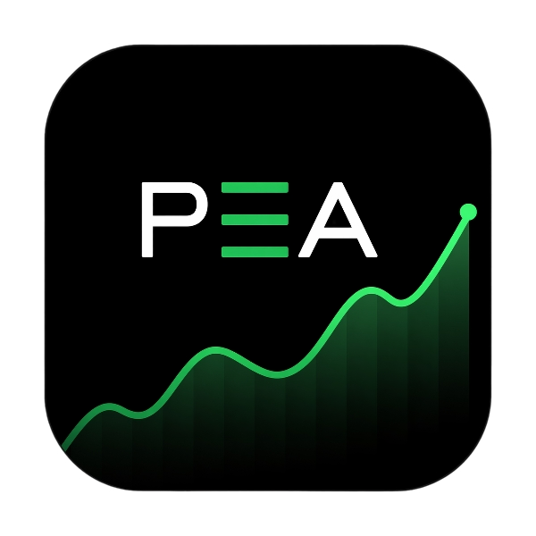
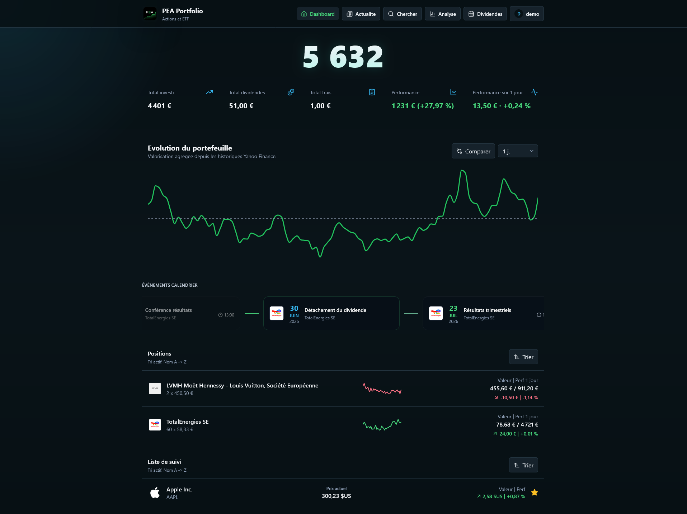
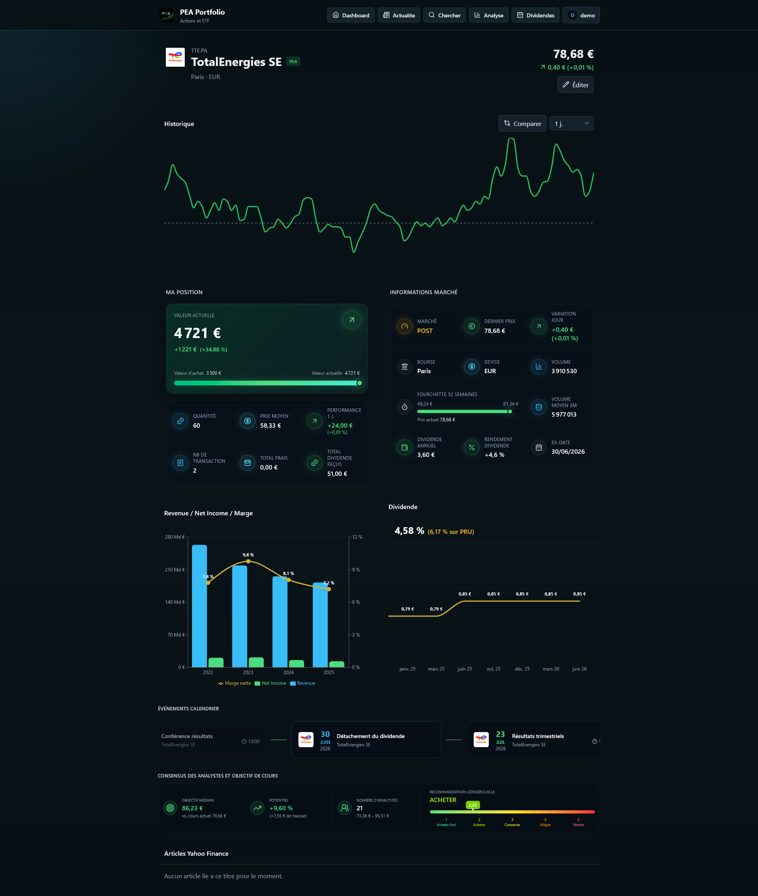
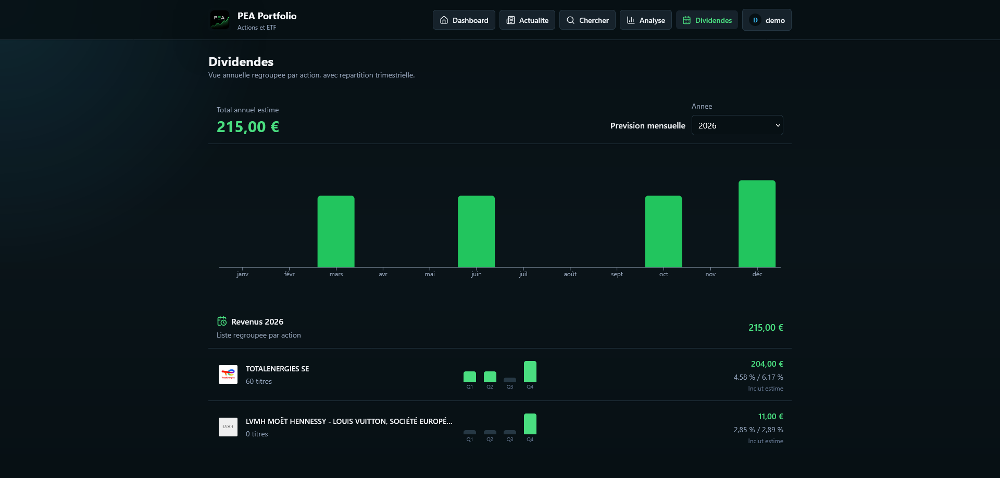
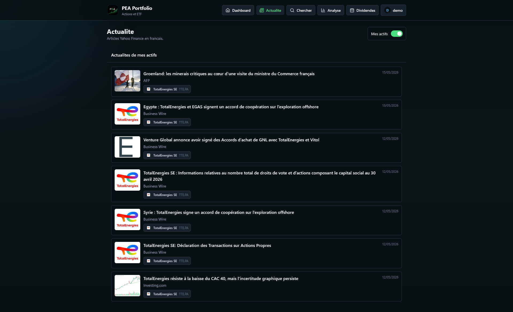

<p align="center">
  
</p>

<h1 align="center">PEA Portfolio</h1>

Application auto-hebergee pour suivre un portefeuille PEA : positions, valorisation,
dividendes, actualites, graphiques de marche et analyses.

## Warning

> [!WARNING]
> Ce projet est **vibe-code**. 
> Utilisez-le uniquement en local, sur un reseau prive ou derriere une protection
> que vous maitrisez.

## Presentation du projet

PEA Portfolio est une application web full-stack pour suivre un Plan d'Epargne en
Actions en local. Le frontend React affiche un tableau de bord sombre et lisible,
tandis que le backend Express stocke les donnees dans SQLite et recupere les
cotations, historiques, dividendes et actualites via Yahoo Finance.

L'objectif est simple : garder ses donnees chez soi, visualiser rapidement la
performance du portefeuille et disposer d'une vue detaillee par actif sans passer
par un service tiers.

Fonctionnalites principales :

- dashboard de portefeuille avec positions, watchlist, performance et calendrier ;
- calendrier des resultats et dividendes (vue mois ou liste, export `.ics`) ;
- page Marches : indices, devises, matieres premieres, taux et listes Yahoo Finance filtrables PEA ;
- screener PEA local (rendement, PER, capitalisation, secteur, performance) avec filtres enregistres,
  et comparateur de 2 a 4 actifs (`/compare?symbols=A,B`), ouverts depuis la page Marches ;
- alertes de cours, moyenne mobile 200 jours, plus haut / plus bas, consensus et detachement,
  evaluees sans appel Yahoo supplementaire, avec cloche de notification dans l'en-tete ;
- fiche detaillee par actif avec historique, informations marche et dividendes ;
- vue annuelle des dividendes avec repartition mensuelle et trimestrielle, et projection
  de l'annee suivante estimee a partir des deux annees precedentes ;
- actualites Yahoo Finance, filtrables sur les actifs suivis, regroupables par actif et
  signalees autour des publications de resultats ;
- imports Boursorama CSV et avis d'operes PDF ;
- objectifs financiers et projections patrimoniales via la page technique `/objectives`,
  avec quatre formes de courbe : lisse, stochastique, chocs aleatoires ou Monte-Carlo ;
- mode prive pour masquer les montants personnels.

### Apercu

| Dashboard | Detail actif |
|---|---|
|  |  |

| Dividendes | Actualites |
|---|---|
|  |  |

## Docker

Le deploiement Docker sert le frontend et l'API depuis le meme conteneur. Le
frontend est disponible sur `/`, l'API sur `/api`, et la base SQLite est
persistante dans `/app/data`.

Exemple de `docker-compose.yml` :

```yaml
services:
  pea-portfolio:
    image: ghcr.io/sargo22341-prog/pea-portfolio:latest
    init: true
    stop_grace_period: 20s
    environment:
      TZ: ${TZ:-Europe/Paris}
      PUBLIC_URL: ${PUBLIC_URL:-}
      TRUST_PROXY: ${TRUST_PROXY:-false}
      LOGO_DEV_API_KEY: ${LOGO_DEV_API_KEY:-}
      SETUP_CODE: ${SETUP_CODE:-}
    volumes:
      - ${PEA_DATA_DIR:-pea-data}:/app/data
    ports:
      - "4000:4000"
    restart: unless-stopped

volumes:
  pea-data:
```

Lancement :

```bash
cp .env.example .env
docker compose up -d
```

Puis ouvrir `http://localhost:4000`.

### Premier demarrage

La creation du premier compte (administrateur) exige un code de configuration, pour
qu'une instance exposee avant sa configuration ne puisse pas etre revendiquee par un
inconnu. Tant qu'aucun compte n'existe, le serveur affiche ce code dans ses logs :

```bash
docker compose logs pea-portfolio | grep "setup code"
```

Le code est regenere a chaque demarrage. Pour choisir un code fixe, definissez
`SETUP_CODE` (il n'est alors jamais ecrit dans les logs).

### Donnees et mise a jour

Les donnees (base SQLite, icones, logs) sont stockees dans un volume nomme `pea-data`.
Pour utiliser un dossier de l'hote, definissez `PEA_DATA_DIR`. **Si vous utilisiez
l'ancien exemple (`/data:/app/data`), definissez `PEA_DATA_DIR=/data` pour retrouver vos
donnees.**

Le conteneur demarre en root uniquement pour rendre le dossier de donnees au compte
`node`, puis execute le serveur sous ce compte. A l'arret (`docker compose stop`), le
serveur termine les taches en cours et ferme proprement la base.

Les fichiers de `/app/data/log` tournent a 5 Mo (3 archives conservees par fichier).

Le build frontend est embarque dans l'image Docker. Il n'est pas stocke dans le
volume `/app/data`, car ce ne sont pas des donnees utilisateur.

Chaque push sur `main` publie une version : image `ghcr.io/sargo22341-prog/pea-portfolio`
(tags `X.Y.Z` et `latest`) et APK Android signe attache a la
[GitHub Release](https://github.com/sargo22341-prog/Pea/releases). Fonctionnement et notes de
version : [docs/release.md](docs/release.md).

## Env

| Variable | Defaut | Portee | Utilisation |
|---|---:|---|---|
| `PORT` | `4000` | Backend | Port du serveur Express. En Docker, gardez `4000` sauf si vous adaptez aussi le mapping de ports et le healthcheck. |
| `TZ` | `Europe/Paris` | Backend + Docker | Fuseau horaire des calculs de marche. |
| `DEBUG` | `false` | Backend + frontend build | Active les logs et options de debug. |
| `DEBUG_DATE` | vide | Backend | Force une date pour tester les comportements temporels. A eviter en production reelle. |
| `ENABLE_MARKET_LIVE_REFRESH` | `true` | Backend | Active le rafraichissement automatique via Yahoo Finance ; genere plus de requetes Yahoo. |
| `PUBLIC_URL` | vide | Backend Docker | Origine publique attendue derriere un domaine ou reverse proxy, par exemple `https://pea.example.com`. |
| `TRUST_PROXY` | `false` | Backend Docker | A mettre a `true` uniquement derriere un reverse proxy de confiance (un seul saut) : l'adresse client est alors lue dans `X-Forwarded-For`. Sans proxy, laissez `false`, sinon cet en-tete falsifiable contourne la limitation de debit et le frein anti-brute-force. Avec un proxy mais `false`, tous les clients partagent l'adresse du proxy (limite de 120 requetes/min commune) : le serveur le signale une fois dans ses logs. |
| `CORS_ORIGINS` | vide | Backend | Origines cross-origin autorisees, separees par des virgules. Utile si un client externe n'est pas servi depuis la meme origine que l'API. En developpement, les origines locales (Vite, Capacitor) sont toujours autorisees. |
| `SETUP_CODE` | genere | Backend | Code exige pour creer le premier compte. Vide : un code aleatoire est genere a chaque demarrage et affiche dans les logs. |
| `PEA_DATA_DIR` | volume `pea-data` | Docker | Dossier de l'hote monte sur `/app/data` a la place du volume nomme. |
| `LOGO_DEV_API_KEY` | vide | Backend | Cle optionnelle pour recuperer automatiquement des logos d'actifs. |


## Developpement local

Prerequis : Node.js 26+ et npm 10+.

Copiez `.env.dev.example` vers `.env` :

```bash
cp .env.dev.example .env
```

Variables utiles uniquement en developpement local :

| Variable | Defaut | Utilisation |
|---|---:|---|
| `NODE_ENV` | `development` | Force le backend local a charger `.env` et a accepter les origines Vite. |
| `VITE_API_BASE_URL` | `http://localhost:4000` | URL du backend utilisee par Vite en developpement. |
| `WAIT_FOR_HEALTH_TIMEOUT_MS` | `30000` | Timeout du script local qui attend `/health` avant de lancer Vite. |

```bash
npm install
npm run dev
```

Services :

| Service | URL |
|---|---|
| Frontend Vite | `http://localhost:5173` |
| Backend API | `http://localhost:4000` |

Scripts utiles :

```bash
npm run build
npm run typecheck
npm run lint
npm test
```

## Stack

| Couche | Technologie |
|---|---|
| Frontend | React, Vite, Tailwind CSS, Recharts, React Router |
| Backend | Node.js, Express, TypeScript |
| Base de donnees | SQLite avec `better-sqlite3` |
| Donnees marche | Yahoo Finance via `yahoo-finance2` |
| Mobile | Capacitor Android |
| Deploiement | Docker / Docker Compose |

## Licence

Ce projet est distribue sous licence [MIT](LICENSE).
